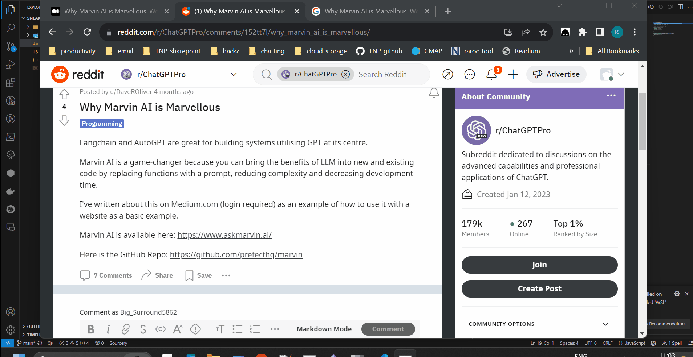

# Sneaky-reader

This repository contains a small `javascript` application that can be used as
`chrome` extension. Specifically, this `chrome` extension allows the user to 
bypass the pay-wall on several websites like 

- [medium](https://www.google.com/search?q=medium&rlz=1C1CHBF_en-GBGB1047GB1047&oq=medium+&gs_lcrp=EgZjaHJvbWUyBggAEEUYOTIQCAEQABiDARixAxiABBiKBTIHCAIQABiABDIGCAMQRRg8MgYIBBBFGEEyBggFEEUYPDIGCAYQRRg8MgYIBxBFGDzSAQgxMDU5ajBqN6gCALACAA&sourceid=chrome&ie=UTF-8)
- [financial-times](https://www.ft.com/)
- [south-china-morning-post](https://www.scmp.com/)
  
# Installation 

1. Firstly, clone the present repository in your local machine; e.g. 
```PowerShell
> git clone https://github.com/specialkapa/sneaky-reader.git
```

2. Then launch `chrome`.
3. At the url bar paste the following link and hit enter: [chrome://extensions/](chrome://extensions/).
4. At the top left click the *Load unpacked* button. 
5. once prompted tp select the extension directory navigate to where you cloned the present repository and select this cloned project.


# Usage 

🎉 Congratz! Now you can do the following: 

1. Fetch the url of any article and/or post, paste in your `chrome` url bar and finally click on *Sneaky-Reader* after clicking on the extensions icon. 
2. In any web-page with an article/post link embedded you can simply right click on the link and select *Sneaky-Read* from the drop down list.  

